I found out an amazing [JVM tutorial](http://www.waytoeasylearn.com/2016/04/jvm-tutorial.html) *by* [Ashok Kumar ](https://plus.google.com/113338311861115463183) for starter like me. 
This post mainly come form tutorial above.
<!-- more -->
## What is Virtual?
This is not having physical existence.
## What is Virtual machine?
* Virtual machine is a simple software program which simulates the functions of a physical machine.
* This is not having physical existence, but which can perform all operations like physical machines.
* Physical machine whatever it is doing, all those things we can able to do on the virtual machine.
* Best example of virtual machine is calculator in computer; it is worked like physical calculator.<br>
All virtual machines categorized in to 2 types
1. Hardware based or System based Virtual Machine
2. Software based or Application based or process based Virtual Machine

## Hardware based virtual machines
Physically only one physical machine is there but several logical machines we can able to create on the single physical machine with strong isolation (worked independently) of each other. This type of virtual machines is called hardware based virtual machines. 
Main advantage of hardware based virtual machine is effective utilization of hardware resources. Most of the times these types of virtual machines associated with admin role (System Admin, Server Admin etc). Programmers never associated with the hardware based virtual machines. 
Examples of hardware based virtual machines are
1. KVM (Kernel Based VM) for Linux systems
2. VMware
3. Xen
4. Cloud Computing

## Software based virtual machines
These virtual machines acts as run time engine to run a particular programming language applications. Examples of software based virtual machines are 
1. JVM (Java Virtual Machine) acts as runtime engine to run Java applications
2. PVM (Parrot Virtual Machine) acts as runtime engine to run Perl applications
3. CLR (Common Language Runtime) acts as runtime engine to run .NET based applications

## JVM
JVM is the part of JRE and it is responsible to load and run the java class file. The following picture depicts basic architecture of the JVM.
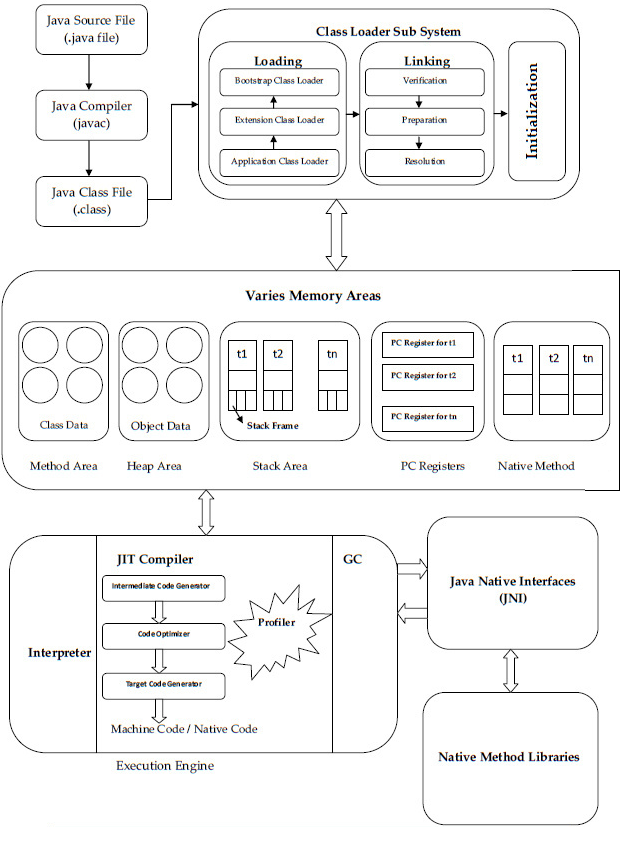

The first component in JVM is Class Loader Sub System

### Class Loader Sub System
This system is responsible for loading .class file with 3 activities
i. Loading
ii. Linking
iii. Initialization                                                            
#### Loading
Loading means read .class file from hard disk and store corresponding binary data inside method area of JVM. For each .class file JVM will store following information
1. Fully qualified name of class
2. Fully qualified name of immediate parent
3. Whether .class file represents class|interface|enum
4. Methods|Constructors|Variables information
5. Modifiers information
6. Constant Pool information

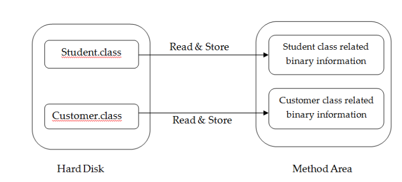

After loading the class file and store inside method area, immediately JVM will perform one activity i.e., create an object of type java.lang.Class in heap area.
Created object is not student object or customer object. It is a predefined class “Class” object that is presently in java.lang package. The created object is represents either student class binary information or customer class binary information.
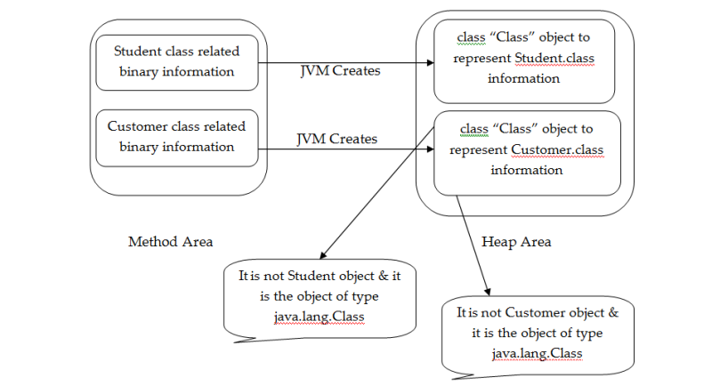
Here the created class “Class” object is used by programmer. For example,
```java
package com.carrotexpress.test;

public class UserInformation {
    private String memberId;
    private String memberType;

    public String getMemberId() {
        return memberId;
    }

    public void setMemberId(String memberId) {
        this.memberId = memberId;
    }

    public String getMemberType() {
        return memberType;
    }

    public void setMemberType(String memberType) {
        this.memberType = memberType;
    }
}
```

```java
package com.carrotexpress.test;

import java.lang.reflect.Field;
import java.lang.reflect.Method;

public class Test1 {
    public static void main(String[] args) throws ClassNotFoundException{
        Class clazz = Class.forName("com.carrotexpress.test.UserInformation");
        Method[] methods = clazz.getDeclaredMethods();
        for(Method method : methods){
            System.out.println(method);
        }
        Field[] fields= clazz.getDeclaredFields();
        for(Field field:fields){
            System.out.println(field);
        }
    }
}
```
Output is:
```ftl
public void com.carrotexpress.test.UserInformation.setMemberType(java.lang.String)
public java.lang.String com.carrotexpress.test.UserInformation.getMemberId()
public void com.carrotexpress.test.UserInformation.setMemberId(java.lang.String)
public java.lang.String com.carrotexpress.test.UserInformation.getMemberType()
private java.lang.String com.carrotexpress.test.UserInformation.memberId
private java.lang.String com.carrotexpress.test.UserInformation.memberType
```
For every loaded .class file, only one class “Class” object will be created by JVM, even though we are using that class multiple times in our program. 
For example,

```java
package com.carrotexpress.test;

import java.lang.reflect.Field;
import java.lang.reflect.Method;

public class Test2 {
    public static void main(String[] args) throws ClassNotFoundException {
        UserInformation userInformation1 = new UserInformation();
        Class clazz1 = userInformation1.getClass();

        UserInformation userInformation2 = new UserInformation();
        Class clazz2 = userInformation2.getClass();

        System.out.println(clazz1.hashCode());
        System.out.println(clazz2.hashCode());
    }
}
```

Output is:

```ft1
1834188994
1834188994
```


Here UserInformation class object created two times, but class is loaded only once. In the above program even through we are using UserInformation class multiple times only one class Class object got created.

#### Linking

After “loading” activity JVM immediately perform Linking activity. Linking once again contain 3 activities,

1. Verification
2. Preparation
3. Resolution

Java language is the secure language. Through java spreading virus, malware these kind of this won’t be there. If you execute old language executable files (.exe) then immediately we are getting alert message saying you are executing .exe file it may harmful to your system.

 But in java .class files we never getting these alert messages. What is the reason is inside JVM a special component is there i.e., Byte Code Verifier. This Byte Code Verifier is responsible to verify weather .class file is properly formatted or not, structurally correct or not, generated by valid compiler or not. If the .class file is not generated by valid compiler then Byte Code Verifier raises runtime error java.lang.VerifyError. This total process is done in **verification** activity. 

In **preparation** phase, JVM will allocate memory for class level static variables and assigned default values.

E.g. For int ---> 0, For double ---> 0.0, For boolean ---> false

Here just default values will be assigned and original values will be assigned in initialization phase.

Next phase is **Resolution**. It is the process of replacing all symbolic references used in our class with original direct references from method area.

```java
package com.carrotexpress.test;

import java.lang.reflect.Field;
import java.lang.reflect.Method;

public class Resolution {//Repalced with Resolution.class
    public static void main(String[] args) throws ClassNotFoundException {
        String strinfg = new String("bunny");//Repalced with String.class
        UserInformation userInformation1 = new UserInformation();//Repalced with UserInformation.class 
        //Also there's others such as Object.class in Method Area
    }
}
```

For the above class, class loader sub system loads `Resolution.class`, `String.class`, `UserInformation.class` and `Object.class`. Every user defined class the parent class is Object.class so every sub class its parent class must be loaded. The names of these classes are stored in “Constant Pool” of “Resolution” class.

In Resolution phase these names are replaced with Actual references from the method area.

#### Initialization

In Initialization activity, for class level static variables assigns original values and static blocks will be executed from top to bottom.

While Loading, Linking and Initialization if any error occurs then we will get runtime Exception saying java.lang.LinkageError. Previously we discussed about VerifyError. This is the child class of LinkageError.

Types of class loaders in class loader subsystem,

1. Bootstrap class loader/ Primordial class loader
2. Extension class loader
3. Application class loader/System class loader

#####  Bootstrap class loader 

Bootstrap class loader is responsible for to load classes from bootstrap class path. Here bootstrap class path means, usually in java application internal JVM uses rt.jar. All core java API classes like String class, StringBuilder class, StringBuffer class, java.lang packages, java.io packages etc are available in rt.jar. This rt.jar path is known as bootstrap class path and the path of rt.jar is:

`jdk ---> jre ---> lib ---> rt.jar`

This location by default consider as bootstrap class path. This Bootstrap class loader is responsible for loading all the classes inside this rt.jar. This Bootstrap class loader is implemented not in java it is implemented by native languages like C, C++ etc.

##### Extension class loader

The extension class loader is the child of bootstrap class loader. This class loader is responsible to load classes from extension class path:

`jdk ---> jre ---> lib ---> ext ---> rt.jar`

The extension class loader is responsible for loading all the classes present in the ext folder. This Extension class loader is implemented in java only. The class name of extension class loader is:

`sun.misc.Launcher$ExtClassLoader.class`

#####  Application class loader

 The Application class loader is the child of Extension class loader. This class loader is responsible to load classes from Application class path. Application class path means classes in our application (Environment variable class path). It internally uses environment variable path. This Application class loader is implemented in java only. The class name of application class loader is:

`sun.misc.Launcher$AppClassLoader.class`

```java
package com.carrotexpress.test;

public class Test {
    public static void main(String[] args) throws ClassNotFoundException {
        System.out.println(String.class.getClassLoader());
        System.out.println(com.sun.java.accessibility.AccessBridge.class.getClassLoader());
        System.out.println(Test.class.getClassLoader());
    }
}
```

Output is:

```
null	//Because Bootstrap class loader is not java object it is designed with C or C++
sun.misc.Launcher$ExtClassLoader@2077d4de	//Here i found a class AccessBridge.class in %JAVA_HOME%/jre/lib/ext
sun.misc.Launcher$AppClassLoader@18b4aac2      
```

#### How Java Class loader works?

Class loader sub system follows delegation hierarchy algorithm. The algorithm simply looks like as following.


JVM execute java program line by line. Whenever JVM come across a particular class first JVM will check weather this .class file is already loaded or not. If it is loaded JVM uses that loaded class from method area otherwise JVM will requests class loader sub system to load the .class file then class loader sub system sends that request to application class loader. 

Application class loader won't load that requested class, simply it delegates to extension class loader. Extension class loader also won't load that requested class, simply it delegates to boot strap class loader. Now boot strap class loader search in boot strap class path. If the class is found in boot strap class path then loaded otherwise it delegates to extension class loader.

Now extension class loader searches in extension class path. If the class is found in extension class path then loaded otherwise it delegates to application class loader. Application class loader now searches in application class path.

If the class is found in application class path then loaded. Suppose boot strap class loader unable find, extension class loader unable to find, application class loader unable to find then we will get run time exception called "**ClassNotFound**" exception. This is the algorithm that class loader sub system follows. This algorithm is called “Delegation hierarchy algorithm”.

Here the highest priority will be bootstrap class path, if the class not found in bootstrap class path the next level priority is extension class path, if the class not found in extension class path the next level priority is application class path.

#### Customized class loader

Sometimes we may not satisfy with default class loader mechanism then we can go for Customized class loader. For example

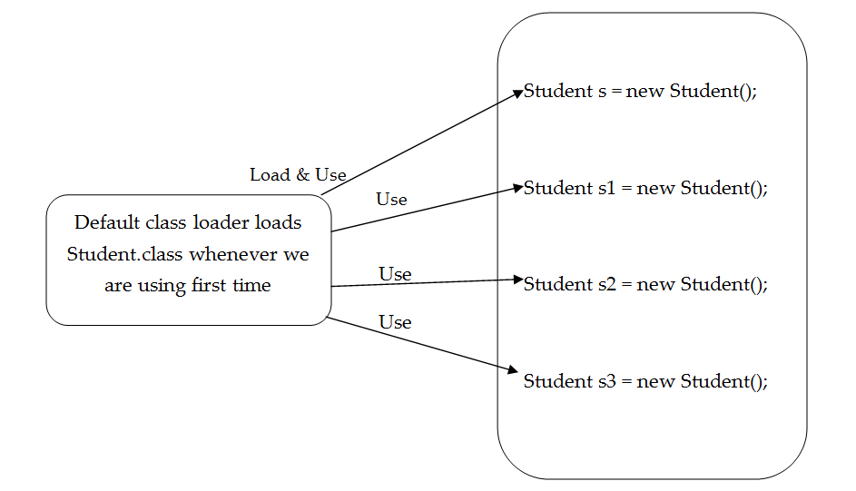

Default class loader loads .class file only once even though we are using multiple times that class in our program. After loading .class file if it is modified outside , then default class loader won't load updated version of .class file on fly, because .class file already there in method area. To overcome this problem we are going to customized class loader.

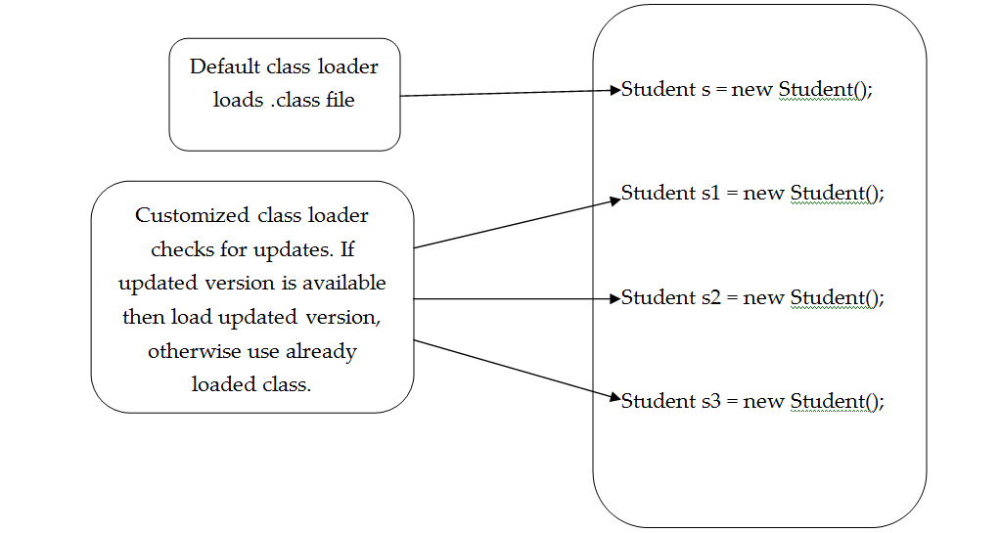

Whenever we are using a class, customised class loader checks whether updated version is available or not. If it is available then load updated version otherwise use already loaded existing .class file, so that updated version available to our program.

```java
package com.carrotexpress.test;

public class CustomizedClassLoader extends ClassLoader {
   public Class loadClass(String cname) throws ClassNotFoundException {
       /* Check whether updated version available or not. 
          If updated version is available then 
          load updated version and returns corresponding 
          class "Class" object. Otherwise return 
          Class object of already loaded .class */
   }
}
```

```java
package com.carrotexpress.test;

class CustomClassLoaderTest {
   public static void main( String arg[]) {
// Default class loader loads Student.class
      Student s1 = new Student(); 
      .
      .
      CustomizedClassLoader c = new CustomizedClassLoader();
// Customized class loader checks updates and load updated version
      c.loadClass(Student); 
      .
      .
// Customized class loader checks updates and load updated version
      c.loadClass(Student); 
   }
}
```

While designing/developing web servers and application servers usually we can go for customized class loaders to customized class loading mechanism.

### Various Memory Areas in JVM

Whenever a Java virtual machine runs a program, it needs memory to store many things, including byte codes and other information it extracts from loaded class files, objects the program instantiates, parameters to methods, return values, local variables, and intermediate results of computations. The Java virtual machine organizes the memory it needs to execute a program into several runtime data areas.

Various memory areas of JVM are

1. Method Area
2. Heap Area
3. Stack Area
4. PC Registers
5. Native Method Stack

#### Method Area

\* For every JVM one method area will be available

\* Method area will be created at the time of JVM start up.

\* Inside method area **class level binary data** including static variables will be stored

\* Constant pools of a class will be stored inside method area.

\* Method area can be accessed by multiple threads simultaneously.

\* The size of the method area need not be fixed. As the Java application runs, the virtual machine can expand and contract the method area to fit the application's needs.

\* All threads share the same method area, so access to the method area's data structures must be designed to be thread-safe. 


#### Heap Area

\* For every JVM one heap area will be available

\* Heap area will be created at the time of JVM start up.

\* **Objects** and corresponding instance variables will be stored in the heap area.

\* Every array in java is object only hence arrays also will be stored in the heap area.

\* Heap area can be access by multiple threads and hence the data stored in the heap area is not thread safe.

\* Heap area need not be continued.


##### Display heap memory statistics

 A java application can communicate with JVM by using **Runtime** class object. A **Runtime** class is a singleton class and we can create Runtime object by using `getRuntime()` method.

```java
Runtime run = Runtime.getRunner();
```

 Once we got runtime object we can call the following methods on that object.

1. `maxMemory()`

​     It returns number of bytes of maximum memory allocated to the heap.

2. `totalMemory()`

​     It returns number of bytes of total memory allocated to the heap.

3. `freeMemory()`

​     It returns number of bytes of free memory present in the heap.
E.g
```java
package com.carrotexpress.test;

public class HeapSpaceDemo {
   public static void main(String[] args) {
      Runtime runtime = Runtime.getRuntime();
      System.out.println("Maximumry " +runtime.maxMemory());
      System.out.println("Totalry " +runtime.totalMemory());
      System.out.println("Freery " +runtime.freeMemory());
   }
}
```
Output:
```
Maximum memory 889192448
Total memory 60293120
Free memory 58719832    
```
##### Set Maximum and Minimum heap size

Heap memory is a finite memory based on our requirement we can increase or decrease heap size. We can use following options for your requirement

`-Xmx`

To set maximum heap size , i.e., maxMemory

java -Xmx512m HeapSpaceDemo

Here mx = maximum size

512m = 512 MB

HeapSpaceDemo = Java class name

`-Xms`

To set minimum heap size , i.e., total memory 

java -Xms65m HeapSpaceDemo   

Here ms = minimum size

65m = 65 MB

HeapSpaceDemo = Java class name

or, you can set a minimum maximum heap size at a time

java -Xms256m -Xmx1024m HeapSpaceDemo

#### Stack Memory

For every thread JVM will create a runtime stack at the time of thread creation. Each and every method call performed by the thread and corresponding local variables will be stored by in the stack,

For every method call a separate entry will be added to the stack and each entry is called *"Stack frame"* or *"activation record".*

After completing the method call the corresponding entry will be removed from the stack. After completing the all method calls the stack will become empty and that empty stack will be destroyed by the JVM just before terminating the thread.

The data stored in the stack is private to the corresponding thread.

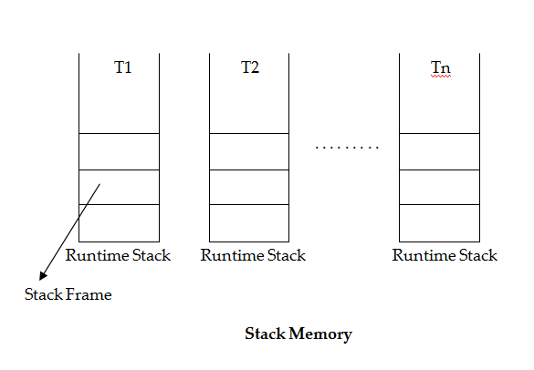

*Stack Frame Structure* contains 3 parts

1. Local Variable Array
2. Operand Stack
3. Frame Data

##### Local Variable Array

\* It contains all parameters and local variables of the method.

\* Each slot in the array is of 4 bytes.

\* Values of type int, float and reference occupied 1 slot in array.

\* Values of type long, double occupied 2 consecutive entries in the array.

\* Values of byte, short, char will be converted to int type before storing and occupy one slot.

\* The way of storing boolean type is varied from JVM to JVM, but most of the JVM's follow one slot for boolean values.


Eg: 

```java
public static void m1(long l, int i, double d, String s) {
	...........................
	...........................
}
```

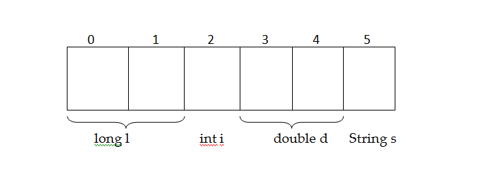

##### Operand Stack

\* JVM uses operand stack as work space.

\* Some instructions can push the values to the operand stack and some instructions perform required operations and some instructions store results etc.

\* The operand stack follows the last-in first-out (LIFO) methodology.

\* For example, the iadd instruction adds two integers by popping two ints off the top of the operand stack, adding them, and pushing the int result. Here is how a Java virtual machine would add two local variables that contain ints and store the int result in a third local variable:


iload_0    // push the int in local variable 0

iload_1    // push the int in local variable 1

iadd       // pop two ints, add them, push result

istore_2   // pop int, store into local variable 2

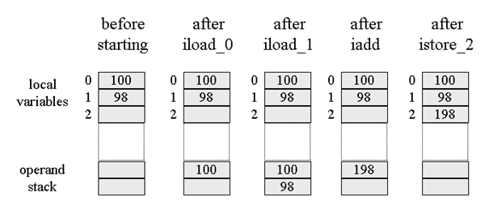

##### Frame Data

In addition to the local variables and operand stack, the Java stack frame includes data to support constant pool resolution, all symbolic references related to that method, normal method return, and exception dispatch. 

This data is stored in the **frame data** portion of the Java stack frame. It also contains a referenced to exception table which contains corresponding catch block information in the case of exceptions. When a method throws an exception, the Java virtual machine uses the exception table referred to by the frame data to determine how to handle the exception.

Whenever the Java virtual machine encounters any of the instructions that refer to an entry in the constant pool, it uses the frame data's pointer to the constant pool to access that information.

#### PC Registers(Program Counter Registers)

For every thread a separate PC register will be created at the time of thread creation. PC register contains address of current executing instruction. Once instruction execution completes automatically PC register will be incremented to hold address of next instruction. An "address" can be a native pointer or an offset from the beginning of a method's byte codes.   

#### Native Method Stack

Here also for every Thread a separate run time stack will be created. It contains all the native methods used in the application. Native method means methods written in a language other than the Java programming language. In other words, it is a stack used to execute C/C++ codes invoked through JNI (Java Native Interface). According to the language, a C stack or C++ stack is created.

When a thread invokes a Java method, the virtual machine creates a new frame and pushes it onto the Java stack. When a thread invokes a native method, however, that thread leaves the Java stack behind. Instead of pushing a new frame onto the thread's Java stack, the Java virtual machine will simply dynamically link to and directly invoke the native method.

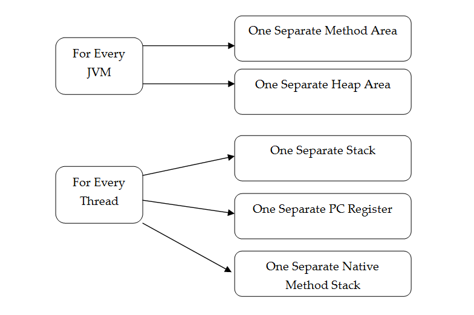

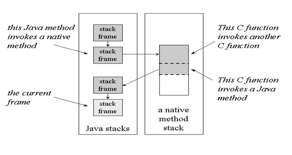

### Execution Engine

This is the core of the JVM. Execution engine can communicate with various memory areas of JVM. Each thread of a running Java application is a distinct instance of the virtual machine’s execution engine. The byte code that is assigned to the runtime data areas in the JVM via class loader is executed by the execution engine.

The execution engine reads the Java Byte code in the unit of instruction. It is like a CPU executing the machine command one by one. Each command of the byte code consists of a 1-byte OpCode and additional Operand. The execution engine gets one OpCode and execute task with the Operand, and then executes the next OpCode. Execution engine mainly contain 2 parts.
1. Interpreter
2. JIT Compiler

Whenever any java program is executing at the first time interpreter will comes into picture and it converts one by one byte code instruction into machine level instruction.  JIT compiler (just in time compiler) will comes into picture from the second time onward if the same java program is executing and it gives the machine level instruction to the process which are available in the buffer memory. The main aim of JIT compiler is to speed up the execution of java program.

#### Interpreter

It is responsible to read byte code and interpret into machine code (native code) and execute that machine code line by line. The problem with interpret is it interprets every time even some method invoked multiple times which effects performance of the system. To overcome this problem SUN people introduced JIT compilers in 1.1 V.

#### JIT Compiler

The JIT compiler has been introduced to compensate for the disadvantages of the interpreter. The main purpose of JIT compiler is to improve the performance. Internally JIT compiler maintains a separate count for every method. Whenever JVM across any method call, first that method will be interpreted normally by the interpreter and JIT compiler increments the corresponding count variable. 

This process will be continued for every method once if any method count reaches thread hold value then JIT compiler identifies that method is a repeatedly used method (Hotspot) immediately JIT compiler compiles that method and generates corresponding native code. Next time JVM come across that method call then JVM directly uses native code and executes it instead of interpreting once again, so that performance of the system will be improved. Threshold is varied from JVM to JVM. Some advanced JIT compilers will recompile generated native code if count reaches threshold value second time so that more optimized code will be generated. **Profiler** which is the part of JIT compiler is responsible to identify **Hotspot** (Repeated Used Methods).

*Note*： JVM interprets total program line by line at least once. JIT compilation is applicable only for repeatedly invoked method but not for every method.

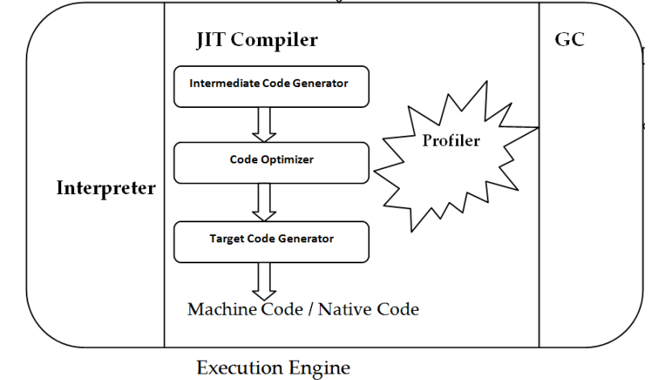

### Java Native Interface (JNI)

JNI is acts as a bridge (Mediator) for java method calls and corresponding native libraries. 


### Class File Structure

```
ClassFile {

    u4               magic_number;

    u2               minor_version;

    u2               major_version;

    u2               constant_pool_count;

    cp_info       constant_pool[constant_pool_count-1];

    u2               access_flags;

    u2               this_class;

    u2               super_class;

    u2               interfaces_count;

    u2               interfaces[interfaces_count];

    u2               fields_count;

    field_info   fields[fields_count];

    u2               methods_count;

    method_info  methods[methods_count];

    u2               attributes_count;

    attribute_info attributes[attributes_count];

}

```


#### magic_number

\* This is a predefined value to identify the Java class file.

\* This value should be 0xCAFEBABE.

\* JVM will use this value to identify whether the class file is valid or not and also to know whether the class file is generated by valid compiler or not.


#### major and minor versions

\* major and minor versions represent class file version

\* JVM will use these versions to identify which version of compiler generates the current .class file

\* If a class file has major version number M and minor version number m, we denote the version of its class file format as M.m.

\* Major and minor versions both are allocates 2 bytes

\* The possible values are: 

| major | major | Java platform version |
| ----- | ----- | --------------------- |
| 45    | 3     | 1.0                   |
| 45    | 3     | 1.1                   |
| 46    | 0     | 1.2                   |
| 47    | 0     | 1.3                   |
| 48    | 0     | 1.4                   |
| 49    | 0     | 1.5                   |
| 50    | 0     | 1.6                   |
| 51    | 0     | 1.7                   |
| 52    | 0     | 1.8                   |

```java
package com.carrotexpress.test;

import java.io.*;

public class ClassVersionChecker {
    private static void checkClassVersion() throws Exception {
        DataInputStream in = 
     new DataInputStream(new FileInputStream("C://Test.class"));
        int magic = in.readInt();
        if (magic != 0xcafebabe) {
              System.out.println(" It is not a valid class!");
        }
        int minor = in.readUnsignedShort();
        int major = in.readUnsignedShort();
        System.out.println( major + " . " + minor);
        in.close();
   }
   public static void main(String[] args) throws Exception {
        checkClassVersion();
   }
}
```

*Note:* Higher version JVM can always run class files generated by lower version compiler but lower version JVM can’t run class files generated by higher version compiler. If we are trying to run then we will get run time exception saying UnsupportedClassVersionError:Test : unsupported major.minor version.

#### constant_pool_count

​     The value of the constant_pool_count item is equal to the number of entries in the constant_pool table plus one. The constant pool table is where most of the literal constant values are stored. This includes values such as numbers of all sorts, strings, identifier names, references to classes and methods, and type descriptors.

#### constant_pool[]

It represents information about constants present in the constant table. The constant_pool is a table of structures (§4.4) representing various string constants, class and interface names, field names, and other constants that are referred to within the ClassFile structure and its substructures. The format of each constant_pool table entry is indicated by its first “tag” byte.CONSTANT_Class
Tag : 7
Description : The name of a class

#### access_flags

Access flags follows the Constant Pool. It is a 2 byte entry that indicates whether the file defines a class or an interface, whether it is public or abstract or final in case it is a class. Below is a list of some of the access flags and their interpretation.

| Flag Name      | Value  | Interpretation                                               |
| -------------- | ------ | ------------------------------------------------------------ |
| ACC.PUBLIC     | 0x0001 | Declared `public`: may be accessed from outside its package. |
| ACC.FINAL      | 0x0010 | Declared `final`: no subclasses allowed.                     |
| ACC.SUPER      | 0x0020 | Treat superclass methods specially when invoked by the *invokespecial* instruction. |
| ACC.IMTERFACE  | 0x0200 | Is an interface, not a class.                                |
| ACC.ABSTRACT   | 0x0400 | Declared `abstract`: must not be instantiated.               |
| ACC.SYNTHETIC  | 0x1000 | Declared synthetic; not present in the source code.          |
| ACC_ANNOTATION | 0x2000 | Declared as an annotation type.                              |
| ACC.ENUH       | 0x4000 | Declared as an `enum` type.                                  |

*Note*: A class may be marked with the ACC_SYNTHETIC flag to indicate that it was generated by a compiler and does not appear in source code.

#### Others

**CONSTANT_Fieldref** 
Tag : 9
Description : The name and type of a Field, and the class of which it is a member.

**CONSTANT_Methodref**
Tag : 10
Description : The name and type of a Method, and the class of which it is a member.

**CONSTANT_InterfaceMethodref**
Tag : 11
Description : The name and type of a Interface Method, and the Interface of which it is a member.

**CONSTANT_String**
Tag : 8
Description : The index of a CONSTANT_Utf8 entry.

**CONSTANT_Integer**
Tag : 3
Description : 4 bytes representing a Java integer.

**CONSTANT_Float**
Tag : 4
Description : 4 bytes representing a Java float.

**CONSTANT_Long**
Tag : 5
Description : 8 bytes representing a Java long.

**CONSTANT_Double**
Tag : 6
Description : 8 bytes representing a Java double.

**CONSTANT_NameAndType**
Tag : 12
Description : The Name and Type entry for a field, method, or interface.

**CONSTANT_Utf8**
Tag : 1  
Description : 2   bytes for the length, then a string in Utf8 (Unicode) format.

**this_class**
Next 2 bytes after access_flags is this_class. It represents the fully qualified name of the current class.

**super_class**
 Next 2 bytes after this_class is super_class. It represents the fully qualified name of the super class.

**interfaces_count**
Next 2 bytes after super_class is interfaces_count. It represents the number of interfaces implemented by the current class.


**interfaces[]**
     It represents the names of interfaces implemented by the current class.

**fields_count**
     It represents the number of fields present in the current class.

**fields[]**
     It represents field information present in the current class.

**methods_count**
     It represents the number of methods present in the current class.

**methods[]**
     It represents method information present in the current class.

**attributes_count**
     It represents the number of attributes present in the current class.

**attributes[]**
     It represents attribute information present in the current class.

